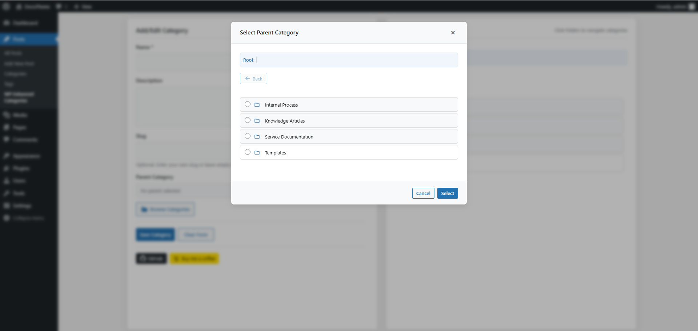

# WP Enhanced Categories

A modern and user-friendly way to manage WordPress categories with an enhanced UI/UX. This plugin provides a folder-like interface for managing your WordPress categories, making it easier to organize and maintain your content hierarchy.

## Features

- Modern, intuitive folder-like interface with breadcrumb navigation
- Visual category hierarchy with back button navigation
- Custom confirmation dialogs for category deletion
- Recursive subcategory deletion handling
- Easy parent category selection through visual modal
- Inline category editing and deletion
- Visual indicators for categories with subcategories
- Clean, responsive design that integrates with WordPress admin
- Smooth animations and transitions
- Efficient category management for large hierarchies

## Screenshots

### Main Admin Interface

The main interface showing the category management system with folder-like navigation and breadcrumbs.

### Parent Category Selection

Modal dialog for selecting parent categories with intuitive navigation and visual hierarchy.

## Installation

1. Upload the plugin files to the `/wp-content/plugins/wp-enhanced-categories` directory
2. Activate the plugin through the 'Plugins' menu in WordPress
3. Access the enhanced category manager via Posts > WP Enhanced Categories

## Usage

### Managing Categories
- Create new categories with name, description, and optional slug
- Edit existing categories with a simple click
- Delete categories with smart confirmation dialogs
- Easily set or change parent categories through the visual selector
- Navigate through category hierarchy using breadcrumbs and back button

### Parent Category Selection
- Browse categories in a folder-like modal
- Visual indicators show which categories have subcategories
- Back button navigation for easy browsing
- Select parent categories with a single click

### Form Features
- Clear form fields with dedicated clear buttons
- Cancel button when editing categories
- Auto-generated slugs from category names
- Smart validation and error handling

## Requirements

- WordPress 5.0 or higher
- PHP 7.2 or higher
- Modern web browser with JavaScript enabled

## Author

- Pimzino
- https://github.com/Pimzino

## License

GPL v2 or later
